# Resumen ejecutivo

Se implementó **un único motor genético generacional con elitismo** (`ga/core.py`) y se resolvieron con él los cuatro problemas del taller. Lo único que cambia de un problema a otro es la **representación** del cromosoma, la **función de aptitud** y los **operadores** compatibles con esa representación; el bucle evolutivo es idéntico. Esa decisión de diseño es la que hace comparables los resultados entre problemas.

Todos los resultados que aparecen en este informe provienen de ejecuciones reales registradas en `resultados/` (20 tablas CSV y 22 gráficas), generadas con `python experimentos/correr_todo.py` en 323 segundos. Cada configuración se repitió entre 10 y 50 veces con semillas distintas, porque un algoritmo genético es estocástico y una sola corrida no constituye evidencia.

Los cinco hallazgos principales:

1. **La representación importa más que los parámetros.** Codificar N‑Reinas como una permutación elimina por construcción los conflictos de fila y columna y reduce el espacio de búsqueda de N^N a N!; con esa representación el problema se vuelve casi trivial (100 % de éxito).
2. **La tasa de mutación tiene un óptimo intermedio, no monótono.** En el TSP: 0,05 → 393,87; 0,2 → 382,71; 0,9 → 399,07. En la mochila la brecha frente al óptimo pasa de 4,51 % (tasa 0,01) a 0,24 % (tasa 0,1) y vuelve a subir a 1,75 % (tasa 0,3).
3. **Reparar es netamente superior a penalizar** cuando las restricciones aprietan. Con 20 cursos en 20 slots, la reparación consigue horarios factibles en el **100 %** de las corridas y la penalización solo en el **40 %**. En la mochila de 100 objetos la brecha es 0,74 % reparando frente a 5,13 % penalizando.
4. **Una penalización mal calibrada produce respuestas inválidas.** Con λ = max(valor/peso), en la mochila de 50 y 100 objetos la mejor solución de la corrida **excede la capacidad en el 56,7 % de los casos**.
5. **El elitismo no siempre ayuda; su efecto depende de cuán restringido esté el problema.** Es decisivo en la asignación apretada (0 % → 40 % de factibilidad), irrelevante en la mochila, y ligeramente perjudicial en N‑Reinas con poblaciones pequeñas.

---

# 1. Conceptos clave

## 1.1 ¿Qué es un algoritmo genético y por qué es una técnica de búsqueda/optimización dentro de la IA?

Un **algoritmo genético** es un método de búsqueda estocástica inspirado en la evolución biológica. Mantiene una **población** de soluciones candidatas, mide la calidad de cada una con una **función de aptitud**, y construye la siguiente generación **seleccionando** a las mejores y **recombinándolas** y **mutándolas**. Repitiendo el ciclo, la población se desplaza hacia regiones del espacio de búsqueda con mejor aptitud.

Pertenece a la Inteligencia Artificial porque resuelve el problema genérico de **encontrar una solución buena en un espacio demasiado grande para recorrerlo entero**, sin conocer de antemano dónde está. Su lugar en la asignatura se entiende por contraste con los dos métodos vistos antes:

| Método | Necesita | Explora | Problema típico |
|---|---|---|---|
| **Gradiente descendente** (Clase 2) | Función **diferenciable y convexa**; conocer el gradiente | Una sola solución, siguiendo la pendiente | Se queda en el mínimo local si la función no es convexa; no aplica a espacios discretos |
| **Hill‑Climbing** (Clase 3) | Solo una operación *Tweak*; no necesita el gradiente | Una sola solución, por vecindad aleatoria | Óptimos locales, mesetas y crestas |
| **Algoritmo genético** (Clase 4) | Solo una función de aptitud | **Una población** de soluciones en paralelo, con recombinación | Coste computacional; no garantiza el óptimo |

La diferencia decisiva para este taller es que los cuatro problemas son **combinatorios y discretos**: una ruta, una permutación de reinas, una asignación de slots o un vector de ceros y unos no admiten derivada, de modo que el gradiente descendente queda descartado desde el planteamiento. Y frente a Hill‑Climbing, el algoritmo genético mantiene **muchas** soluciones a la vez, lo que reduce el riesgo de quedar atrapado en un único óptimo local: si un individuo se estanca, otros siguen explorando otras regiones.

## 1.2 Población, individuo, cromosoma, gen, selección, cruzamiento, mutación, elitismo y función de aptitud

Se usa la terminología de la Clase 4, tomada de Luke, S. (2009), *Essentials of Metaheuristics*:

| Concepto | Definición | Cómo se concreta en este taller |
|---|---|---|
| **Individuo** | Una solución candidata completa | Un tablero de N reinas, una ruta, un horario, una selección de objetos |
| **Población** | Conjunto de individuos que evolucionan a la vez | De 20 a 300 individuos según el experimento (parámetro `tam_poblacion`) |
| **Cromosoma** | El genotipo: la estructura de datos del individuo, un vector de longitud fija | `np.ndarray` de tamaño N |
| **Gen** | Una posición concreta del cromosoma | En el TSP, la ciudad que ocupa la posición *i* de la ruta |
| **Alelo** | El valor concreto que toma un gen | En la mochila, 0 o 1 |
| **Función de aptitud** | Mide la calidad de un individuo | Conflictos, distancia, penalización o valor |
| **Evaluación de la aptitud** | Calcular ese valor para un individuo | `cfg.aptitud(individuo)` |
| **Paisaje de la aptitud** | La "forma" de la función de calidad sobre el espacio de búsqueda | Determina lo difícil que es el problema |
| **Selección** | Elegir qué individuos se reproducen, según su aptitud | Torneo (k=3), ruleta o truncamiento |
| **Cruzamiento / recombinación** | Tomar dos padres e intercambiar secciones para producir (normalmente) dos hijos | OX, PMX, un punto, uniforme |
| **Mutación (*Tweak*)** | Cambio pequeño y aleatorio en un individuo | Intercambio, inversión, inserción, bit‑flip, reasignación |
| **Elitismo** | Copiar intactos a la siguiente generación los *e* mejores individuos | Parámetro `elitismo`; `0` lo desactiva |
| **Generación** | Un ciclo completo de evaluación, reproducción y reemplazo | Una iteración del bucle de `ejecutar_ga` |

Dos precisiones importantes sobre el **elitismo**. Primero, su efecto: garantiza que la calidad del mejor individuo **nunca empeore** de una generación a la siguiente, cosa que sin él sí puede ocurrir, porque el cruce y la mutación son ciegos y pueden destruir una buena solución. Segundo, su coste: al reservar plazas fijas para los mismos individuos, **reduce la diversidad** de la población y, con ello, la exploración. Es el mismo compromiso que la Clase 4 describe entre las estrategias evolutivas **(μ + λ)** —los padres compiten con los hijos, más explotación, riesgo de convergencia prematura— y **(μ, λ)** —los hijos reemplazan a los padres, más exploración—. El elitismo implementado aquí es exactamente un esquema (μ + λ) parcial, y las Secciones 3.3 y 7.3 muestran empíricamente que ese compromiso unas veces resulta decisivo y otras sale caro.

## 1.3 ¿Por qué es fundamental una función de aptitud adecuada? Maximización frente a minimización

La función de aptitud es **la única información que el algoritmo tiene sobre el problema**. El motor no sabe qué es una reina ni una ciudad: solo compara números. Si la aptitud no distingue una solución buena de una mala, la selección se vuelve aleatoria y el algoritmo degenera en una búsqueda ciega. Tres exigencias concretas:

1. **Debe discriminar con finura.** Una aptitud binaria (válido / no válido) no da ninguna pista de *cuán cerca* está una solución de ser válida, y el algoritmo no puede mejorar progresivamente. Este efecto se midió: en la mochila, la penalización "fuerte" hunde a todas las soluciones inválidas por igual y pierde ese gradiente; con capacidad 76 alcanza el óptimo solo en el **20 %** de las corridas frente al **100 %** de la reparación (Sección 6.2).
2. **Debe reflejar todas las restricciones que importan.** En la asignación de cursos se separaron restricciones duras (peso 1000) y blandas (peso 1 a 10) precisamente para que el algoritmo nunca sacrifique la factibilidad del horario a cambio de comodidad.
3. **Debe ser barata de calcular.** Se evalúa `tam_poblacion × generaciones` veces por corrida. Por eso los conflictos de N‑Reinas se calculan con `np.bincount` sobre las diagonales, en tiempo O(N), en lugar del doble bucle O(N²) del enunciado.

**Maximización y minimización** son el mismo problema con distinto signo. El motor de este taller **siempre maximiza**, por convenio, y cada problema aplica la transformación que le corresponde:

| Problema | Magnitud natural | Objetivo | Transformación usada |
|---|---|---|---|
| N‑Reinas | Conflictos | Minimizar | `aptitud = -conflictos` (óptimo = 0) |
| TSP | Distancia | Minimizar | `aptitud = 1 / (distancia + ε)` |
| Asignación | Penalización | Minimizar | `aptitud = -penalización` |
| Mochila | Valor | Maximizar | `aptitud = valor` (sin transformar) |

La transformación `1/(distancia + ε)` que sugiere el enunciado no es un capricho: la **selección por ruleta exige aptitudes no negativas**, porque reparte la ruleta en porciones proporcionales al valor. Con `-distancia` todas las aptitudes serían negativas y el método no funcionaría. En cambio, con **selección por torneo** las dos formas son equivalentes, porque el torneo solo compara cuál es mayor y `1/x` es una transformación monótona.

## 1.4 Operadores para cromosomas de permutación frente a cromosomas binarios

Esta es la distinción central del taller, y la razón es la **dependencia entre genes**:

- En un cromosoma **binario** (mochila) o **entero** (asignación), los genes son **independientes**: llevar el objeto 3 no impide llevar el 7. Cualquier combinación de valores representa una solución con sentido, así que el cruce de un punto y el uniforme funcionan sin más.
- En un cromosoma de **permutación** (TSP, N‑Reinas), los genes están **acoplados** por una restricción global: cada valor debe aparecer exactamente una vez. Visitar una ciudad impide volver a visitarla. Un cruce que mezcle dos permutaciones sin cuidado produce un vector que ya no es una permutación.

| | **Permutación** (TSP, N‑Reinas) | **Binario / entero** (Mochila, Asignación) |
|---|---|---|
| **Cruce** | **OX** (Order Crossover), **PMX** (Partially Mapped Crossover) | Un punto, dos puntos, **uniforme** |
| **Mutación** | **Intercambio** (swap), **inversión**, **inserción** | **Bit‑flip**, reasignación aleatoria del gen |
| **Por qué** | Deben devolver siempre una permutación válida | Cada gen se puede alterar por separado |

**OX** copia un segmento contiguo de un padre y rellena el resto con los genes del otro en el orden en que aparecen, saltando los que ya están; preserva el **orden relativo**. **PMX** intercambia un segmento y usa el mapeo gen‑a‑gen que ese segmento induce para deshacer los duplicados que quedan fuera; preserva mejor la **posición absoluta**. Ambos están verificados: 500 cruces sobre tamaños 6, 8, 10 y 15 producen siempre permutaciones válidas (`ga/operadores.py`, función `es_permutacion_valida`).

Entre las mutaciones de permutación, la **inversión** merece una nota: invertir un segmento de la ruta equivale a un movimiento **2‑opt** del TSP clásico, porque rompe exactamente dos aristas y las reconecta. Esa afinidad con la estructura del problema se refleja en los resultados (Sección 5.2), donde es el operador que mejores rutas encuentra.

## 1.5 Riesgos de una tasa de mutación demasiado baja o demasiado alta

La mutación es el mecanismo de **exploración**; el cruce y la selección son los de **explotación**. Desequilibrar esa balanza tiene consecuencias opuestas y ambas malas:

| | **Tasa demasiado baja** | **Tasa demasiado alta** |
|---|---|---|
| **Qué ocurre** | La población pierde diversidad y todos los individuos acaban siendo casi idénticos | Los hijos se parecen poco a sus padres; se destruye lo aprendido |
| **Consecuencia** | **Convergencia prematura**: el algoritmo se estanca en un óptimo local, igual que Hill‑Climbing (Clase 3) | La búsqueda degenera en **aleatoria**; el algoritmo deja de acumular progreso |
| **Síntoma observable** | La curva de convergencia se aplana muy pronto y no vuelve a mejorar | La curva oscila sin tendencia clara |

Ambos extremos se midieron de forma directa:

**Mochila** (30 corridas, presupuesto ajustado, capacidad 152, óptimo = 493):

| Tasa de mutación | Valor promedio | Corridas que alcanzan el óptimo | Brecha promedio |
|---|---|---|---|
| 0,01 | 470,8 | 3,3 % | **4,510 %** |
| 0,05 | 488,4 | 50,0 % | 0,933 % |
| **0,10** | **491,8** | **73,3 %** | **0,243 %** |
| 0,30 | 484,4 | 10,0 % | 1,751 % |

**TSP** (10 corridas, 15 ciudades, presupuesto ajustado):

| Tasa de mutación | Mejor | Peor | Promedio |
|---|---|---|---|
| 0,05 | 370,15 | 424,13 | 393,87 |
| **0,20** | **367,52** | **415,56** | **382,71** |
| 0,90 | 378,67 | 438,44 | 399,07 |

En ambos casos la relación es una **U**: el rendimiento mejora al subir la tasa desde valores muy bajos, alcanza un óptimo intermedio y se degrada al seguir subiendo. No existe, por tanto, una "tasa alta es mejor" ni una "tasa baja es más segura": hay un punto de equilibrio que depende del problema.

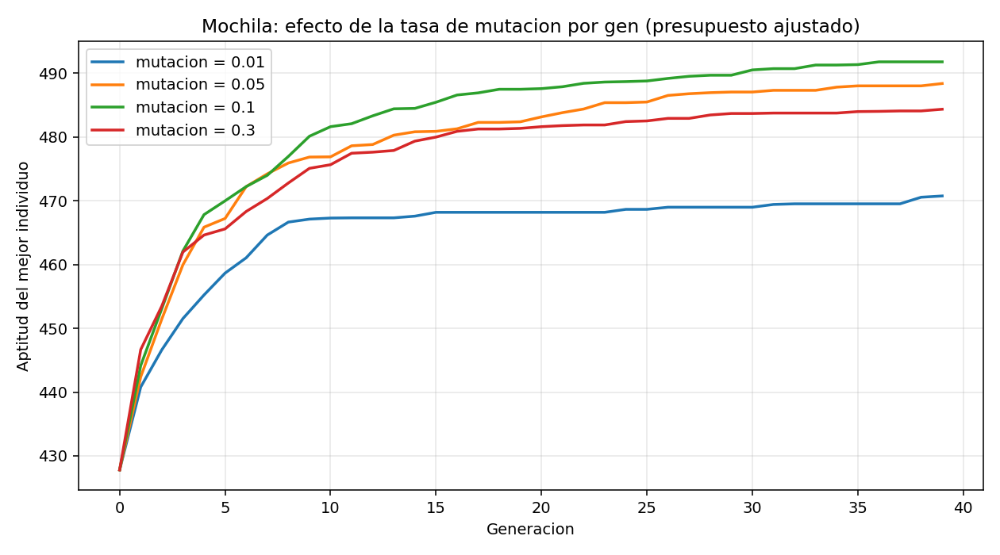

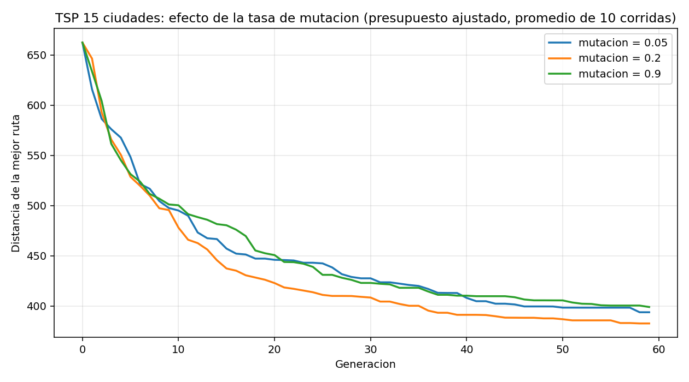

---

# 2. Metodología

## 2.1 Arquitectura del código

```
Taller1_Geneticos/
├── ga/                    MOTOR COMPARTIDO
│   ├── core.py            bucle generacional, elitismo, criterios de parada
│   ├── seleccion.py       torneo, ruleta, truncamiento
│   ├── operadores.py      OX, PMX, swap, inversión, inserción, un punto, uniforme, bit-flip
│   └── estadisticas.py    resúmenes de N corridas y gráficas
├── problemas/             REPRESENTACIÓN + APTITUD (uno por problema, ejecutables sueltos)
├── experimentos/          BARRIDOS que generan las tablas y gráficas de este informe
├── datos/                 instancias (matrices de distancia, tablas de cursos/salas/objetos)
├── resultados/            20 CSV y 22 PNG: la evidencia
└── web/                   aplicativo Streamlit, una página por problema
```

El motor implementa el esquema generacional de la Clase 4:

1. Inicializar la población con individuos aleatorios.
2. Repetir hasta el criterio de parada:
   a. Evaluar la aptitud de todos los individuos.
   b. Almacenar el mejor individuo encontrado hasta el momento.
   c. **Reproducción**: selección de padres → cruce → mutación.
   d. **Operador Join**: reemplazo de la población, conservando *e* élites.

## 2.2 Parámetros y protocolo experimental

| Parámetro | Valor por defecto | Rango explorado |
|---|---|---|
| Tamaño de población | 100 | 20 – 150 |
| Generaciones máximas | 300 | 40 – 400 |
| Probabilidad de cruce | 0,9 | fija |
| Tasa de mutación | según problema | 0,01 – 0,9 |
| Elitismo | 2 | 0 y 2 |
| Selección | torneo, k = 3 | torneo, ruleta, truncamiento |

**Reproducibilidad.** Todas las instancias se generan con semilla fija (`SEMILLA_DATOS = 2024`) y cada corrida *i* usa la semilla *i*. Volver a ejecutar `experimentos/correr_todo.py` reproduce exactamente las mismas tablas.

**Número de repeticiones.** 10 corridas en el TSP (mínimo que exige el enunciado), 30 en N‑Reinas, asignación y mochila, y 50 en el estudio de operadores de N‑Reinas, donde las diferencias eran del tamaño del ruido estadístico.

## 2.3 Nota metodológica: el presupuesto de cómputo

Al ejecutar las instancias del enunciado con un presupuesto amplio (población 100, 300 generaciones) apareció un problema para el análisis: **el algoritmo resuelve las tres instancias del TSP al óptimo en las 10 corridas, con desviación estándar cero**, y alcanza el óptimo de la mochila de 15 objetos en el 100 % de las corridas. Todas las configuraciones empatan, así que ninguna comparación entre operadores es posible.

Ese resultado se reporta tal cual, porque es una conclusión válida y favorable. Pero para poder **comparar**, los estudios de operadores se repiten con un **presupuesto ajustado** (población 30, 40–60 generaciones), y los de escalado amplían las instancias (30 y 50 ciudades, 20 cursos, 30/50/100 objetos). Al limitar los recursos o endurecer el problema, las diferencias entre configuraciones sí se vuelven medibles. Cada tabla indica qué presupuesto usa.

---

# 3. Problema base: N‑Reinas

## 3.1 Representación y función de aptitud

**Cromosoma:** permutación de tamaño N. El **índice** es la columna y el **valor** es la fila de la reina de esa columna. Para N=6, `[2, 5, 1, 4, 0, 3]` significa que la reina de la columna 0 está en la fila 2.

Esta elección es la decisión de diseño más importante del problema: al ser una permutación, **dos reinas nunca comparten fila** (los valores no se repiten) **ni columna** (cada índice aparece una vez). El espacio de búsqueda cae de N^N a N! —para N=8, de 16,7 millones a 40.320— y solo quedan por resolver los ataques en **diagonal**.

**Aptitud:** número de pares de reinas que se atacan, a minimizar; el motor recibe `-conflictos`. El óptimo vale 0, así que la corrida se detiene en cuanto lo alcanza. El cálculo cuenta cuántas reinas caen en cada diagonal (`fila − columna` y `fila + columna`) y suma las combinaciones de a dos, en tiempo O(N). Se verificó contra la formulación de doble bucle del enunciado en 200 tableros aleatorios.

**Operadores:** OX o PMX + intercambio. Sustituyen al cruce de un punto con reparación de duplicados del código original, que además de no ser un operador de permutación legítimo puede lanzar `IndexError` cuando la lista de valores faltantes se agota.

## 3.2 Resultados: N ∈ {6, 8} × población × tasa de mutación

30 corridas por configuración, máximo 300 generaciones, OX + intercambio, elitismo 2.

| N | Población | Mutación | Éxito | Gens. promedio | Gens. mín–máx | Tiempo |
|---|---|---|---|---|---|---|
| 6 | 20 | 0,05 | **100,0 %** | 59,1 | 1 – 282 | 0,029 s |
| 6 | 20 | 0,10 | 96,7 % | 58,7 | 1 – 283 | 0,032 s |
| 6 | 20 | 0,20 | **100,0 %** | **39,1** | 1 – 227 | 0,019 s |
| 6 | 50 | 0,05 | 96,7 % | 8,3 | 1 – 61 | 0,021 s |
| 6 | 50 | 0,10 | **100,0 %** | **4,2** | 1 – 17 | 0,005 s |
| 6 | 50 | 0,20 | **100,0 %** | 5,4 | 1 – 26 | 0,006 s |
| 6 | 100 | 0,05 | **100,0 %** | 2,0 | 1 – 6 | 0,004 s |
| 6 | 100 | 0,10 | **100,0 %** | 2,1 | 1 – 6 | 0,005 s |
| 6 | 100 | 0,20 | **100,0 %** | **1,9** | 1 – 4 | 0,004 s |
| 8 | 20 | 0,05 | 86,7 % | 62,1 | 1 – 276 | 0,057 s |
| 8 | 20 | 0,10 | 86,7 % | 52,0 | 1 – 296 | 0,066 s |
| 8 | 20 | 0,20 | **100,0 %** | **21,7** | 1 – 155 | 0,017 s |
| 8 | 50 | 0,05 | **100,0 %** | 6,8 | 1 – 63 | 0,013 s |
| 8 | 50 | 0,10 | 96,7 % | **5,7** | 1 – 23 | 0,029 s |
| 8 | 50 | 0,20 | **100,0 %** | 13,0 | 1 – 203 | 0,025 s |
| 8 | 100 | 0,05 | **100,0 %** | 3,4 | 1 – 11 | 0,007 s |
| 8 | 100 | 0,10 | **100,0 %** | **3,2** | 1 – 13 | 0,007 s |
| 8 | 100 | 0,20 | **100,0 %** | 3,9 | 1 – 17 | 0,009 s |

**Lectura de la tabla:**

- **El tamaño de población es el factor dominante.** Para N=8, pasar de 20 a 100 individuos reduce las generaciones necesarias de 52 a 3,2 y lleva la tasa de éxito de 86,7 % a 100 %. Con población 100, la solución aparece a menudo **ya en la población inicial**: 100 permutaciones aleatorias de 8 elementos tienen una probabilidad razonable de contener alguna de las 92 soluciones válidas del tablero 8×8.
- **La tasa de mutación solo importa cuando la población es pequeña.** Con población 20 y N=8, subir la mutación de 0,05 a 0,2 eleva el éxito de 86,7 % a 100 % y casi triplica la velocidad (62,1 → 21,7 generaciones): con pocos individuos la diversidad escasea y la mutación es la única fuente de exploración. Con población 100 las tres tasas son indistinguibles.
- **Las columnas mín–máx revelan la naturaleza estocástica del método.** Con población 20 y N=8 el mejor caso resuelve en la generación 1 y el peor tarda 296. Esa dispersión es justamente la razón por la que se repite cada configuración 30 veces.

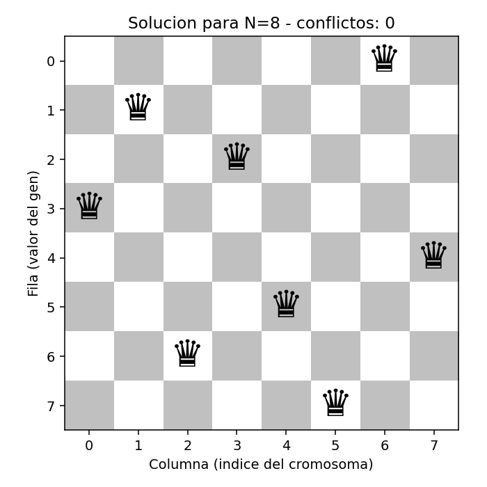

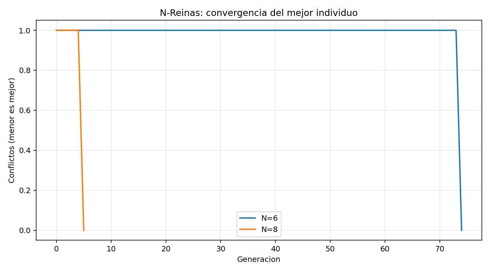

## 3.3 OX frente a PMX, con y sin elitismo

50 corridas por configuración, población 20, mutación 0,1.

| Configuración | Tasa de éxito | Gens. promedio | Conflictos promedio |
|---|---|---|---|
| N=6, OX, sin elitismo | 96,0 % | 33,3 | 0,04 |
| N=6, OX, con elitismo | **98,0 %** | 51,7 | 0,02 |
| N=6, PMX, sin elitismo | 56,0 % | 11,1 | 0,44 |
| N=6, PMX, con elitismo | 42,0 % | 17,8 | 0,58 |
| N=8, OX, sin elitismo | **96,0 %** | 37,3 | 0,04 |
| N=8, OX, con elitismo | 86,0 % | 56,0 | 0,14 |
| N=8, PMX, sin elitismo | 88,0 % | 37,5 | 0,12 |
| N=8, PMX, con elitismo | 80,0 % | 48,2 | 0,20 |

**OX supera claramente a PMX** en este problema (96–98 % frente a 42–88 %). La explicación está en qué información preserva cada operador: PMX conserva la **posición absoluta** de los genes, mientras que OX conserva su **orden relativo**. En N‑Reinas los conflictos dependen de las diferencias `fila − columna` y `fila + columna`, es decir, de las posiciones relativas entre reinas; OX preserva precisamente esa estructura y PMX la rompe con más frecuencia.

**El elitismo resulta ligeramente perjudicial aquí** (86 % frente a 96 % en N=8 con OX). Con una población de solo 20 individuos, reservar 2 plazas para los mismos élites es el 10 % de la población, y esa pérdida de diversidad pesa más que la garantía de no empeorar. Es el compromiso explotación/exploración de la Clase 4 cayendo del lado equivocado.

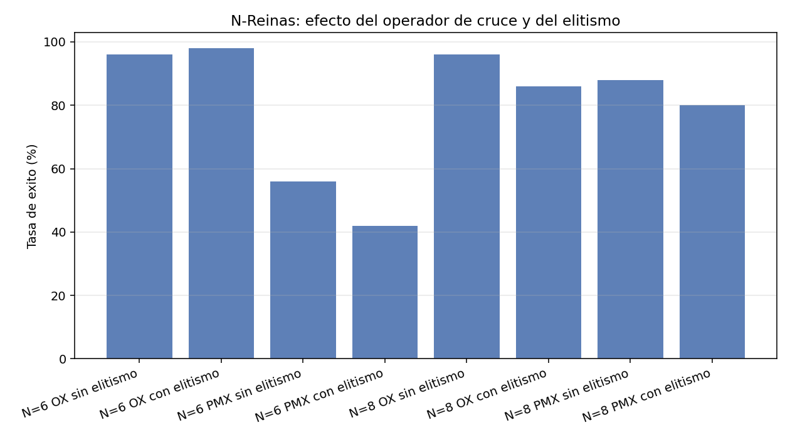

---

# 4. Ejercicio 1 — Agente Viajero (TSP)

## 4.1 Planteamiento

**Instancias:** ciudades generadas con semilla fija en un cuadrado de 100×100, con matriz de distancias euclidianas simétrica que cumple la desigualdad triangular. Se exportan a `datos/tsp_coordenadas_{n}.csv` y `datos/tsp_matriz_{n}.csv` para 8, 10 y 15 ciudades.

**Cromosoma:** permutación de ciudades, p. ej. `[0, 3, 1, 5, 2, 4]`, interpretada como un ciclo cerrado.

**Aptitud:** distancia total del ciclo **incluido el regreso** a la ciudad inicial, transformada como `1 / (distancia + ε)` según indica el enunciado.

**Tamaño del espacio de búsqueda:** (N−1)!/2 rutas distintas, fijando la ciudad de partida y descartando el sentido de recorrido. Para 15 ciudades son más de 43.000 millones.

## 4.2 Instancias del enunciado (presupuesto amplio)

10 corridas, población 100, 300 generaciones, OX + inversión, mutación 0,2, elitismo 2.

| Instancia | Mejor | Peor | Promedio | Desv. | Vecino más cercano | Óptimo exacto | Brecha |
|---|---|---|---|---|---|---|---|
| 8 ciudades | 263,39 | 263,39 | **263,39** | 0,00 | 263,39 | **263,39** | **0,00 %** |
| 10 ciudades | 319,46 | 319,46 | **319,46** | 0,00 | 319,46 | **319,46** | **0,00 %** |
| 15 ciudades | 367,52 | 367,52 | **367,52** | 0,00 | 454,57 | — | — |

**El algoritmo alcanza el óptimo exacto en las 10 corridas** para 8 y 10 ciudades, verificado por fuerza bruta sobre las (N−1)! rutas. La desviación estándar es cero: las diez corridas convergen a la misma ruta.

Para 15 ciudades la fuerza bruta ya no es viable, pero la comparación con la heurística voraz del vecino más cercano es contundente: **367,52 frente a 454,57, una mejora del 19,15 %**. Este es el resultado que justifica el método: una heurística simple y rápida se queda casi un 20 % por encima de lo que encuentra el algoritmo genético.

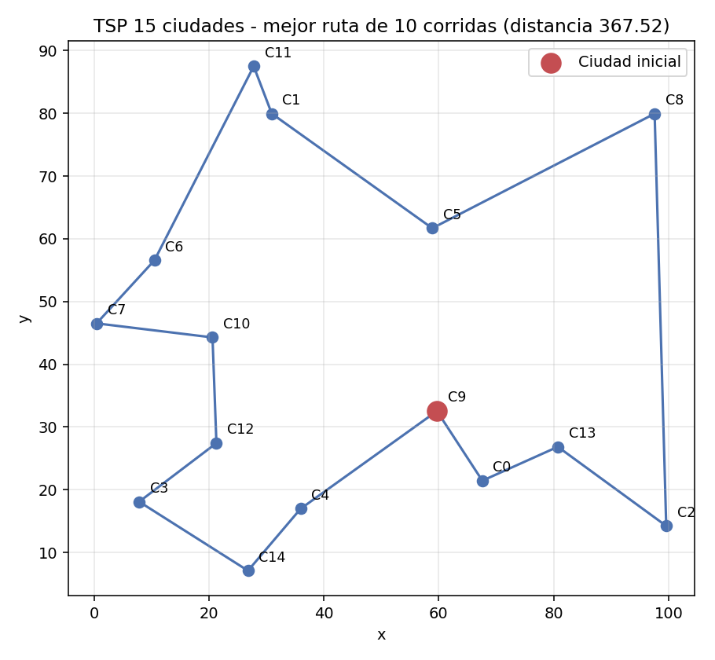

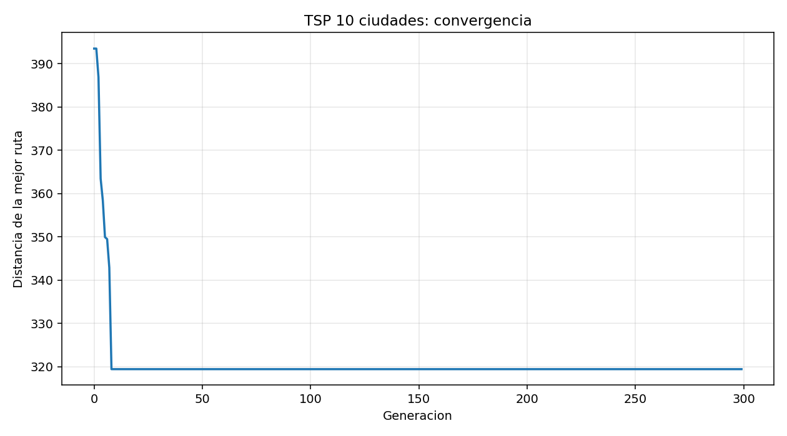

## 4.3 Comparación de operadores (presupuesto ajustado)

10 corridas, 15 ciudades, población 30, 60 generaciones, mutación 0,2, elitismo 2.

| Configuración | Mejor | Peor | Promedio | Desviación |
|---|---|---|---|---|
| **OX + inversión** | **367,52** | **415,56** | **382,71** | **15,09** |
| PMX + inversión | 367,52 | 438,58 | 391,08 | 20,54 |
| OX + intercambio | 367,52 | 434,25 | 400,82 | 23,43 |
| PMX + inserción | 367,52 | 476,54 | 404,15 | 38,97 |
| PMX + intercambio | 367,52 | 464,58 | 414,90 | 33,44 |
| OX + inserción | 367,52 | 490,72 | 418,08 | 34,89 |

Las seis configuraciones encuentran la mejor ruta conocida (367,52) **en alguna** de sus 10 corridas; la diferencia está en la **fiabilidad**, que es lo que miden el promedio y la desviación.

- **La inversión es el mejor operador de mutación**, con los dos primeros puestos de la tabla y las desviaciones más bajas. Como se anticipó en la Sección 1.4, invertir un segmento equivale a un movimiento **2‑opt**: rompe exactamente dos aristas del ciclo y las reconecta en el otro sentido, que es precisamente el tipo de mejora local que necesita una ruta. El intercambio altera hasta cuatro aristas a la vez y la inserción desplaza todo el segmento intermedio; ambos son movimientos más destructivos.
- **OX supera a PMX** cuando se combina con inversión (382,71 frente a 391,08), coherente con lo observado en N‑Reinas: en problemas de ruta lo que importa es el orden relativo de las ciudades, no su posición absoluta.
- **La desviación estándar es tan informativa como el promedio.** OX + inserción tiene la peor dispersión (34,89) y el peor caso más malo (490,72): encuentra buenas rutas a veces, pero no se puede confiar en ella.

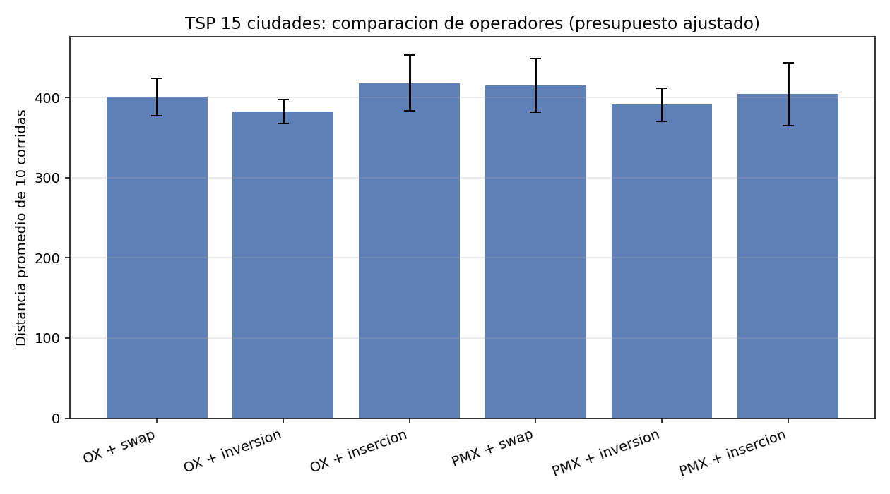

## 4.4 Efecto del elitismo

| Configuración | Mejor | Peor | Promedio | Desviación |
|---|---|---|---|---|
| Sin elitismo | 367,52 | 430,41 | 383,15 | 20,17 |
| **Con elitismo (e=2)** | 367,52 | **415,56** | **382,71** | **15,09** |

El efecto sobre el promedio es marginal (382,71 frente a 383,15), pero **mejora claramente el peor caso** (415,56 frente a 430,41) y **reduce la dispersión en un 25 %** (15,09 frente a 20,17). Es exactamente lo que cabe esperar de su mecanismo: el elitismo no hace que el algoritmo encuentre mejores soluciones, sino que **impide perder las que ya encontró**. Su beneficio se ve en la cola inferior de la distribución, no en la media.

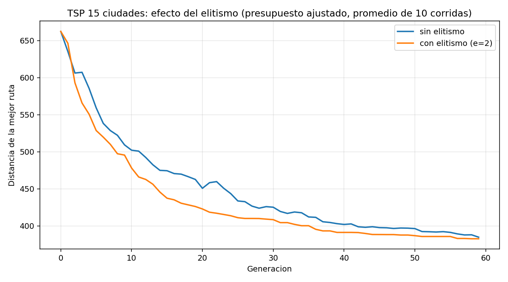

## 4.5 ¿Qué pasa al aumentar el número de ciudades?

Mismo presupuesto de cómputo (población 100, 300 generaciones), instancias crecientes.

| Ciudades | Mejor | Peor | Promedio | Desv. | Vecino más cercano | Mejora vs. voraz | Dispersión relativa |
|---|---|---|---|---|---|---|---|
| 10 | 319,46 | 319,46 | 319,46 | 0,00 | 319,46 | 0,00 % | **0,00 %** |
| 15 | 367,52 | 367,52 | 367,52 | 0,00 | 454,57 | **19,15 %** | **0,00 %** |
| 30 | 480,47 | 519,28 | 490,84 | 12,85 | 534,56 | 8,18 % | 2,62 % |
| 50 | 617,25 | 668,48 | 635,30 | 16,60 | 698,71 | 9,07 % | 2,61 % |

Al crecer la instancia ocurren tres cosas simultáneas:

1. **La consistencia se pierde.** Hasta 15 ciudades las 10 corridas dan idéntico resultado (desviación 0). A partir de 30, cada corrida termina en una ruta distinta y aparece una dispersión del 2,6 %. Con el mismo presupuesto, el algoritmo ya no puede recorrer un espacio que crece factorialmente.
2. **La generación en que aparece la mejor solución se dispara**: 11,3 con 10 ciudades, 44,3 con 15, 138,4 con 30 y 282,1 con 50 —peligrosamente cerca del límite de 300, señal de que el presupuesto se está quedando corto.
3. **Pero la ventaja sobre la heurística voraz se mantiene** (8–9 %). El algoritmo genético deja de encontrar el óptimo, aunque sigue produciendo soluciones claramente mejores que una heurística simple. Para instancias mayores habría que aumentar población y generaciones, o combinarlo con búsqueda local (algoritmo memético).

## 4.6 ¿Por qué no puede usarse un cruzamiento binario simple sin controlar duplicados?

Porque **rompe la representación**. Un cruce de un punto corta ambos padres en la misma posición y pega la primera mitad de uno con la segunda del otro. Sobre vectores de genes independientes eso es correcto; sobre permutaciones, no hay nada que garantice que el resultado siga conteniendo cada ciudad exactamente una vez.

Resultado real del experimento (`experimentos/exp_tsp.py`, función `demostracion_cruce_invalido`):

```
Padre 1  [5, 0, 1, 4, | 2, 6, 3, 7]
Padre 2  [1, 6, 7, 2, | 3, 4, 5, 0]
-------------------------------------
Hijo     [5, 0, 1, 4,   3, 4, 5, 0]

Ciudades repetidas   : 0, 4, 5   (se visitan dos veces)
Ciudades no visitadas: 2, 6, 7
¿Es una ruta válida? : NO
```

El hijo visita tres ciudades dos veces y se olvida de otras tres: **no es una ruta**, no se le puede calcular una distancia con sentido. Hay tres salidas posibles:

1. **Usar operadores de permutación** (OX, PMX), que devuelven siempre un cromosoma válido. Es la solución adoptada.
2. **Reparar** el hijo después del cruce, sustituyendo los duplicados por los faltantes. Es lo que intenta el código original de N‑Reinas, pero su implementación reemplaza la *primera* aparición del valor en lugar de la intrusa y puede agotar la lista de faltantes lanzando `IndexError`.
3. **Penalizar** las rutas inválidas. Es la peor opción: prácticamente todos los hijos serían inválidos y la selección perdería toda capacidad de discriminar.

---

# 5. Ejercicio 2 — Asignación de cursos a salas de cómputo

## 5.1 Diseño de las tablas

**Tabla de cursos** (`datos/cursos.csv`):

| ID | Curso | Estudiantes | Computadores | Software | Franjas bloqueadas |
|---|---|---|---|---|---|
| C1 | Inteligencia Artificial | 28 | Sí | Python | Vie 14:00‑16:00 |
| C2 | Bases de Datos | 35 | Sí | SQL Server | — |
| C3 | Redes de Computadores | 22 | Sí | — | Lun‑Mié 09:00‑11:00 |
| C4 | Algoritmos | 40 | No | — | Lun‑Mié 07:00‑09:00 |
| C5 | Ingeniería de Software | 30 | No | — | — |
| C6 | Machine Learning | 18 | Sí | Python | — |
| C7 | Sistemas Operativos | 25 | Sí | Linux | — |
| C8 | Cálculo Diferencial | 45 | No | — | Mar‑Jue 09:00‑11:00, Vie 14:00‑16:00 |

**Tabla de salas** (`datos/salas.csv`):

| ID | Sala | Capacidad | Computadores | Software disponible |
|---|---|---|---|---|
| S1 | Sala de Cómputo A | 36 | Sí | Python, SQL Server, Linux |
| S2 | Sala de Cómputo B | 28 | Sí | Python, Linux |
| S3 | Aula 101 | 45 | No | — |
| S4 | Aula 202 | 50 | No | — |

**Franjas:** Lun‑Mié 07:00‑09:00, Lun‑Mié 09:00‑11:00, Mar‑Jue 07:00‑09:00, Mar‑Jue 09:00‑11:00, Vie 14:00‑16:00.

La instancia está diseñada para ser exigente pero factible. C2 (Bases de Datos, 35 estudiantes, SQL Server) solo cabe en S1, que es la única sala con capacidad suficiente y ese software: queda prácticamente fijada.

## 5.2 Representación y función de aptitud

**Cromosoma:** vector de 8 genes enteros, uno por curso. Cada gen es un **slot**: `slot = sala × 5 + franja`, con valores 0 a 19.

No es una permutación: dos cursos **pueden** recibir el mismo slot, y eso es precisamente un choque de horario que la aptitud debe castigar. Como los genes son independientes, aquí sí son válidos el cruce de un punto y el uniforme.

**Restricciones duras** (peso 1000, hacen el horario inviable):

| Restricción | Descripción |
|---|---|
| Choque | Dos cursos en la misma sala y la misma franja |
| Sobrecupo | Más estudiantes que la capacidad de la sala |
| Recurso | La sala no tiene los computadores o el software requeridos |
| Franja bloqueada | El curso no puede dictarse en esa franja |

**Restricciones blandas** (peso 1 a 10, solo degradan la calidad):

| Restricción | Peso | Descripción |
|---|---|---|
| Desbalance | 10 | Franjas con carga muy desigual (premia la distribución equilibrada) |
| Holgura | 1 | Sala mucho mayor que el curso: sillas desperdiciadas por encima de 10 |

La diferencia de **dos órdenes de magnitud** entre pesos duros y blandos es deliberada: garantiza que el algoritmo nunca sacrifique la factibilidad del horario a cambio de una mejor distribución. Una sola violación dura (1000) cuesta más que todas las blandas juntas.

## 5.3 Horario obtenido

Mejor solución encontrada: **penalización dura 0** (horario factible), penalización blanda 24,0.

| Sala | Lun‑Mié 07‑09 | Lun‑Mié 09‑11 | Mar‑Jue 07‑09 | Mar‑Jue 09‑11 | Vie 14‑16 |
|---|---|---|---|---|---|
| Sala de Cómputo A | — | C2 Bases de Datos (35) | — | C1 Inteligencia Artificial (28) | C5 Ing. de Software (30) |
| Sala de Cómputo B | C7 Sistemas Operativos (25) | — | C3 Redes (22) | — | C6 Machine Learning (18) |
| Aula 101 | C8 Cálculo Diferencial (45) | — | C4 Algoritmos (40) | — | — |
| Aula 202 | — | — | — | — | — |

Verificación curso a curso (`resultados/asignacion_detalle_final.csv`): sin sobrecupo, todos los recursos requeridos disponibles, todas las franjas permitidas y ningún slot compartido. La penalización blanda residual de 24,0 corresponde al desbalance mínimo alcanzable: 8 cursos no se reparten de forma perfectamente uniforme entre 5 franjas.

Aula 202 queda sin usar, y es la respuesta correcta: al ser la sala más grande (50 plazas), colocar cursos en ella genera holgura penalizable.

## 5.4 Elitismo y manejo de individuos inválidos

**Instancia base** (8 cursos, 40 % de ocupación de slots), 30 corridas:

| Configuración | Factibles | Penal. dura | Penal. blanda | Gen. de la mejor |
|---|---|---|---|---|
| Penalizar, sin elitismo | 100 % | 0,0 | 24,0 | 13,0 |
| Penalizar, con elitismo | 100 % | 0,0 | 24,0 | 10,9 |
| Reparar, sin elitismo | 100 % | 0,0 | 24,0 | **5,2** |
| Reparar, con elitismo | 100 % | 0,0 | 24,0 | **5,2** |

Con la instancia del enunciado **todas las configuraciones alcanzan el 100 % de factibilidad**: el problema es demasiado holgado para distinguirlas. La única diferencia es la velocidad: reparar converge en 5,2 generaciones frente a 10,9–13,0 de penalizar.

**Instancia apretada** (20 cursos en 20 slots, 100 % de ocupación), 30 corridas:

| Configuración | Factibles | Penal. dura | Penal. total prom. | Gen. de la mejor |
|---|---|---|---|---|
| Penalizar, sin elitismo | **0,0 %** | 1933,3 | 1982,2 | 91,0 |
| Penalizar, con elitismo | **40,0 %** | 600,0 | 634,7 | 94,9 |
| Reparar, sin elitismo | **100,0 %** | 0,0 | 22,1 | 28,2 |
| **Reparar, con elitismo** | **100,0 %** | **0,0** | **22,1** | **20,8** |

Aquí sí aparecen diferencias decisivas:

- **El elitismo pasa a ser determinante con penalización**: de 0 % a 40 % de corridas factibles. Cuando encontrar una solución válida es muy difícil, perder la mejor encontrada por un cruce desafortunado es fatal, y el elitismo lo impide.
- **Con reparación el elitismo solo acelera** (20,8 frente a 28,2 generaciones), porque la reparación ya garantiza que todo individuo sea factible.
- **La reparación domina por completo**: 100 % frente a 40 %, y además con mejor calidad blanda (22,1 frente a 34,7).

Las instancias apretadas están construidas **partiendo de un horario válido conocido** y derivando de él los requisitos de cada curso. Eso garantiza que existe al menos una solución factible, de modo que cualquier fallo sea atribuible al algoritmo y no a un problema imposible.

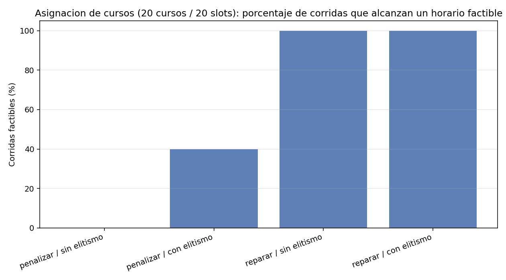

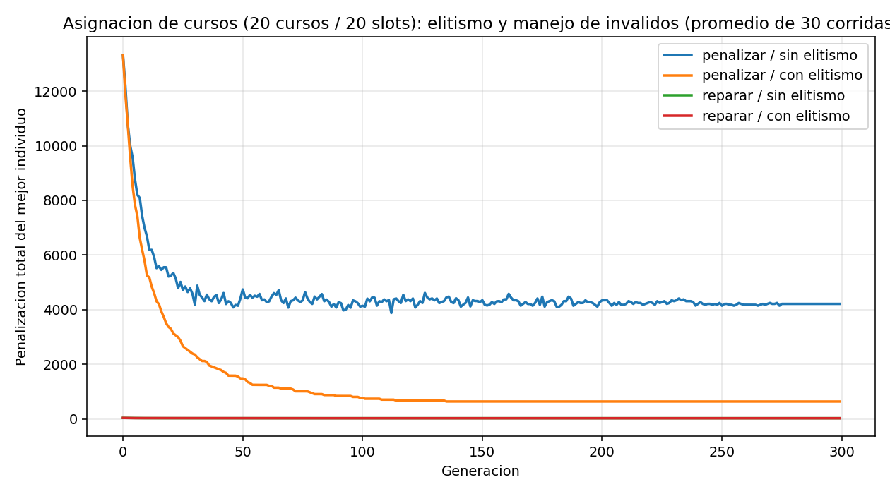

## 5.5 ¿Cómo cambia el resultado al aumentar el número de cursos?

Mismas 4 salas y 5 franjas (20 slots), 30 corridas por configuración:

| Cursos | Ocupación | Estrategia | Factibles | Penal. dura | Penal. blanda | Gen. de la mejor |
|---|---|---|---|---|---|---|
| 8 | 40 % | Penalizar | 100 % | 0,0 | 24,0 | 8,7 |
| 8 | 40 % | Reparar | 100 % | 0,0 | 24,0 | 4,2 |
| 12 | 60 % | Penalizar | 100 % | 0,0 | 38,6 | 59,6 |
| 12 | 60 % | Reparar | 100 % | 0,0 | 37,0 | 8,1 |
| 16 | 80 % | Penalizar | 100 % | 0,0 | 22,6 | 84,1 |
| 16 | 80 % | Reparar | 100 % | 0,0 | **18,0** | **6,2** |
| 20 | 100 % | Penalizar | **40 %** | 600,0 | 34,7 | 94,9 |
| 20 | 100 % | Reparar | **100 %** | **0,0** | **22,1** | 20,8 |

La degradación **no es gradual, es abrupta**. Hasta el 80 % de ocupación ambas estrategias encuentran horarios factibles en el 100 % de las corridas. Al llegar al 100 % —donde cada curso debe ocupar un slot distinto y no sobra ninguno— la penalización se desploma al 40 % mientras la reparación se mantiene.

Lo que cambia antes del desplome es el **esfuerzo**: penalizando, la generación en que aparece la mejor solución crece de 8,7 a 59,6, 84,1 y 94,9, acercándose al límite. La reparación se mantiene entre 4,2 y 20,8. El problema no se vuelve difícil de forma progresiva: se vuelve difícil cuando el espacio de soluciones factibles se estrecha hasta casi desaparecer, y a partir de ahí encontrarlas por azar deja de ser viable.

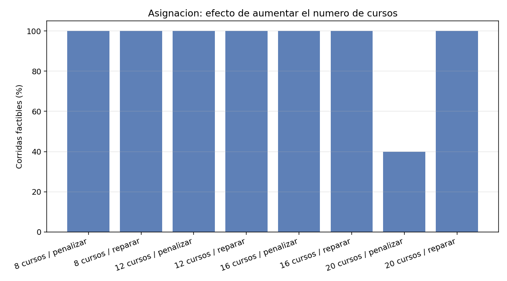

## 5.6 Operador de cruce

| Instancia | Cruce | Factibles | Penal. total promedio |
|---|---|---|---|
| Base (8 cursos) | Un punto | 100 % | 24,0 |
| Base (8 cursos) | Uniforme | 100 % | 24,0 |
| Apretada (20 cursos) | **Un punto** | **60 %** | **438,1** |
| Apretada (20 cursos) | Uniforme | 40 % | 634,7 |

En la instancia apretada, **el cruce de un punto supera al uniforme** (60 % frente a 40 %). El cruce de un punto conserva **bloques contiguos** de asignaciones, y en un horario casi saturado esos bloques son conjuntos de cursos ya colocados sin chocar entre sí: destruirlos cuesta caro. El cruce uniforme reparte gen a gen y deshace esas combinaciones parciales que tanto trabajo costó encontrar.

---

# 6. Ejercicio 3 — Problema de la Mochila (Knapsack 0/1)

## 6.1 Planteamiento

**Instancia:** 15 objetos con pesos entre 5 y 40 y valores no proporcionales al peso (se añade ruido multiplicativo entre 1,5 y 4,0), para que el problema no se resuelva con una regla voraz simple. Peso total: **304**. Valor total: **792**. Tabla completa en `datos/objetos_mochila.csv`.

**Cromosoma binario** de 15 genes: gen = 1 si el objeto se lleva, 0 si no.

**¿Por qué aquí sí sirve un cromosoma binario?** Porque la decisión sobre cada objeto es **independiente** de las demás: llevar el objeto 3 no impide llevar el 7. Cualquier vector de ceros y unos representa una selección con sentido. En el TSP, en cambio, los genes están acoplados —visitar una ciudad impide volver a visitarla— y por eso allí hace falta una permutación. La única restricción de la mochila, el peso total, no es estructural sino un límite sobre el agregado, y se puede tratar desde la función de aptitud.

**Dos capacidades:** 152 (50 % del peso total) y 76 (25 %).

**Referencia exacta:** con 2¹⁵ = 32.768 combinaciones, el óptimo real se calcula por **programación dinámica**, lo que permite medir la **brecha** verdadera del algoritmo genético en lugar de conformarse con comparaciones relativas. Óptimos: **493** para capacidad 152 y **282** para capacidad 76.

## 6.2 Penalización frente a reparación: tres estrategias

Se implementaron tres formas de tratar a los individuos que no caben:

| Estrategia | Mecanismo | Propiedad |
|---|---|---|
| **Penalización débil** | `aptitud = valor − λ·exceso` con **λ = max(valor/peso) = 3,95** | Conserva el **gradiente**: una solución que se pasa por poco sigue siendo atractiva. **No garantiza** que una solución inválida no gane |
| **Penalización fuerte** | `aptitud = valor − λ·exceso` con **λ = suma de valores = 792** | Garantiza que la mejor solución sea válida. **Pierde el gradiente**: todas las inválidas se hunden por igual |
| **Reparación** | Se quitan objetos de peor relación valor/peso hasta que cabe | Toda la población es siempre factible |

Sobre λ conviene una precisión, porque es un error frecuente: el valor `λ = max(valor/peso)` que suele citarse **no basta** para garantizar la validez. El argumento habitual es que cada unidad de peso excedida cuesta más de lo que cualquier objeto puede aportar, pero eso solo vale en la relajación continua. Como los objetos son **discretos**, reparar una solución que se pasa por una unidad puede obligar a sacar un objeto entero, y la pérdida real supera a la penalización aplicada. La consecuencia se midió y aparece en la Sección 6.5.

**Resultados, 30 corridas, población 60, 120 generaciones:**

| Capacidad | Estrategia | Valor prom. | Óptimo | Corridas en el óptimo | Población válida | Gen. de la mejor |
|---|---|---|---|---|---|---|
| 152 | Penalización débil | **493,0** | 493 | **100,0 %** | 64,6 % | 9,7 |
| 152 | Penalización fuerte | 491,4 | 493 | 83,3 % | 74,0 % | 24,6 |
| 152 | **Reparación** | **493,0** | 493 | **100,0 %** | **100,0 %** | **1,8** |
| 76 | Penalización débil | **282,0** | 282 | **100,0 %** | 44,6 % | 8,3 |
| 76 | Penalización fuerte | 260,8 | 282 | **20,0 %** | 60,2 % | 27,2 |
| 76 | **Reparación** | **282,0** | 282 | **100,0 %** | **100,0 %** | **1,0** |

Con 15 objetos el espacio es pequeño y **la reparación alcanza el óptimo en el 100 % de las corridas, en promedio en la primera o segunda generación**. El dato más revelador es el de la penalización fuerte con capacidad 76: solo **20 %** de corridas en el óptimo. Al hundir por igual a todas las soluciones inválidas, la aptitud deja de informar *cuánto* se pasa cada una y el algoritmo pierde la señal que le permitiría acercarse a la frontera desde fuera. Es la demostración práctica de lo enunciado en la Sección 1.3: una aptitud que no discrimina con finura degrada la búsqueda.

La columna **población válida** muestra el otro lado: penalizando, entre el 44 % y el 74 % de la población final respeta la capacidad; el resto son individuos inútiles que consumen presupuesto de evaluación. Reparando es siempre el 100 %.

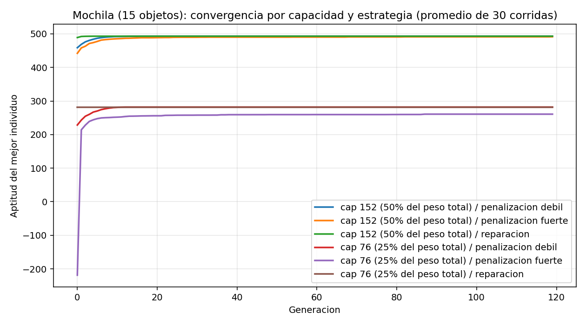

## 6.3 Solución final

Capacidad 152, estrategia de reparación, encontrada en la generación 3:

**Valor 493 (= óptimo exacto), peso 150/152, 7 objetos.**

| Objeto | Peso | Valor | Ratio | Seleccionado |
|---|---|---|---|---|
| O3 | 8 | 24 | 3,00 | **Sí** |
| O4 | 12 | 37 | 3,08 | **Sí** |
| O6 | 15 | 44 | 2,93 | **Sí** |
| O8 | 32 | 85 | 2,66 | **Sí** |
| O9 | 37 | 146 | 3,95 | **Sí** |
| O10 | 39 | 136 | 3,49 | **Sí** |
| O11 | 7 | 21 | 3,00 | **Sí** |
| O1, O2, O5, O7, O12, O13, O14, O15 | — | — | — | No |

Nótese que la solución óptima **no** es simplemente "los objetos de mejor ratio": O14 tiene ratio 2,57, superior al 2,03 de O13, y ninguno de los dos entra, mientras que sí entra O8 con ratio 2,66. Esto confirma que la instancia no es resoluble por una regla voraz y justifica el uso de una metaheurística.

## 6.4 Tasa de mutación, elitismo y cruce

**Tasa de mutación** (bit‑flip **por gen**), presupuesto ajustado, capacidad 152: ver tabla de la Sección 1.5. El óptimo está en 0,1, que con 15 genes equivale a 1,5 bits cambiados por hijo. Tasas de 0,01 (0,15 bits por hijo, casi ninguna exploración) y 0,3 (4,5 bits, demasiada destrucción) degradan el resultado.

**Elitismo y cruce**, presupuesto ajustado:

| Configuración | Valor promedio | Corridas en el óptimo | Brecha |
|---|---|---|---|
| Un punto, sin elitismo | 488,8 | 50,0 % | 0,859 % |
| Un punto, con elitismo | 488,4 | 50,0 % | 0,933 % |
| Uniforme, sin elitismo | **490,0** | **56,7 %** | **0,615 %** |
| Uniforme, con elitismo | 486,6 | 46,7 % | 1,305 % |

Las diferencias (46,7 % – 56,7 %) están dentro del ruido estadístico para 30 corridas: **ni el elitismo ni el operador de cruce tienen un efecto apreciable en la mochila**. Es un resultado esperable y vale la pena decirlo explícitamente: con 15 genes independientes y una aptitud suave, el problema no es lo bastante difícil para que estas decisiones importen. Compárese con la asignación apretada, donde el elitismo marcaba la diferencia entre 0 % y 40 % de factibilidad. **La utilidad de un mecanismo depende de la dificultad del problema, no es una propiedad absoluta del mecanismo.**

## 6.5 Escalado: donde penalizar y reparar dejan de empatar

Instancias de 15, 30, 50 y 100 objetos con el mismo presupuesto ajustado (población 30, 40 generaciones), capacidad 50 % del peso total, 30 corridas, óptimo exacto por programación dinámica en todos los casos.

| Objetos | Estrategia | Brecha promedio | En el óptimo | Población válida | **Mejor solución inválida** |
|---|---|---|---|---|---|
| 15 | Penalización débil | −0,027 % | 90,0 % | 63,7 % | **3,3 %** |
| 15 | Penalización fuerte | 0,933 % | 50,0 % | 73,9 % | 0,0 % |
| 15 | **Reparación** | **0,000 %** | **100,0 %** | **100 %** | **0,0 %** |
| 30 | Penalización débil | 0,140 % | 23,3 % | 46,8 % | **43,3 %** |
| 30 | Penalización fuerte | 2,569 % | 0,0 % | 73,4 % | 0,0 % |
| 30 | **Reparación** | **0,290 %** | **33,3 %** | **100 %** | **0,0 %** |
| 50 | Penalización débil | 1,604 % | 0,0 % | 45,2 % | **56,7 %** |
| 50 | Penalización fuerte | 3,827 % | 0,0 % | 69,7 % | 0,0 % |
| 50 | **Reparación** | **0,182 %** | **13,3 %** | **100 %** | **0,0 %** |
| 100 | Penalización débil | 5,127 % | 0,0 % | 45,4 % | **56,7 %** |
| 100 | Penalización fuerte | 7,843 % | 0,0 % | 69,2 % | 0,0 % |
| 100 | **Reparación** | **0,736 %** | 0,0 % | **100 %** | **0,0 %** |

Tres lecturas:

1. **La reparación gana con claridad creciente.** Con 100 objetos su brecha es del **0,74 %** frente al 5,13 % de la penalización débil y el 7,84 % de la fuerte: siete y diez veces mejor.
2. **La brecha negativa de la penalización débil con 15 objetos (−0,027 %) no es un error: es el síntoma.** Significa que la "mejor" solución obtuvo un valor *superior* al óptimo, lo cual solo es posible si **no cabe en la mochila**. La última columna lo confirma: en el 3,3 % de las corridas con 15 objetos, y en el **56,7 %** con 50 y 100 objetos, la respuesta que devuelve el algoritmo excede la capacidad. Es una respuesta inservible presentada como solución, y es el riesgo concreto de una penalización mal calibrada.
3. **La penalización fuerte es honesta pero ineficiente.** Nunca devuelve una solución inválida, pero al perder el gradiente su brecha es la peor de las tres en todas las instancias.

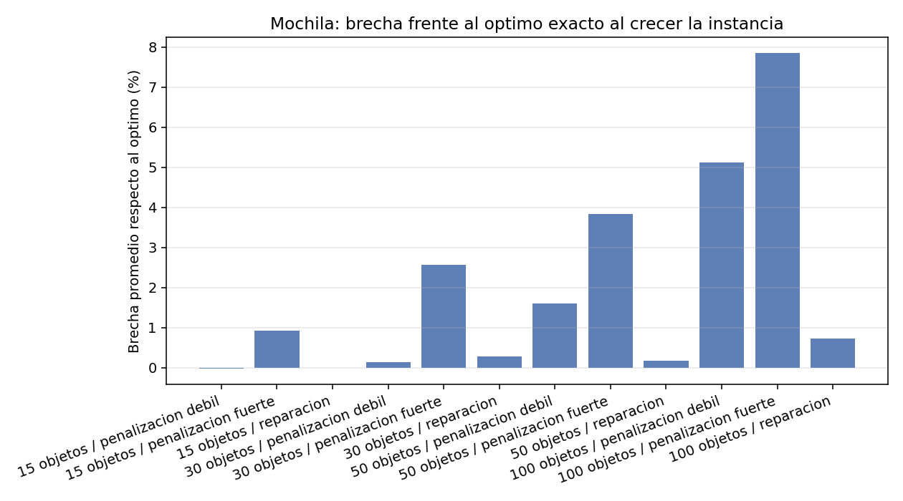

---

# 7. Análisis comparativo

## 7.1 Resumen por problema

| | **N‑Reinas** | **TSP** | **Asignación** | **Mochila** |
|---|---|---|---|---|
| **Representación** | Permutación | Permutación | Vector entero | Vector binario |
| **Genes** | Acoplados | Acoplados | Independientes | Independientes |
| **Tamaño del espacio** | N! | (N−1)!/2 | 20⁸ ≈ 2,6·10¹⁰ | 2¹⁵ = 32.768 |
| **Objetivo** | Minimizar conflictos | Minimizar distancia | Minimizar penalización | Maximizar valor |
| **Cruce** | OX | OX | Un punto | Indiferente |
| **Mutación** | Intercambio | **Inversión** | Reasignación | Bit‑flip |
| **Tasa óptima** | 0,2 (poblaciones pequeñas) | 0,2 | 0,1 | 0,1 |
| **Efecto del elitismo** | Ligeramente negativo | Positivo (reduce dispersión) | **Decisivo** (0 % → 40 %) | Nulo |
| **Restricciones** | Por construcción | Por construcción | Penalizar vs. reparar | Penalizar vs. reparar |
| **Mejor resultado** | 100 % éxito | Óptimo exacto en 8, 10 | Factible, blanda 24 | Óptimo exacto (493, 282) |

## 7.2 ¿Penalizar o reparar?

La evidencia de este taller es consistente en los dos problemas donde se comparó: **reparar es preferible siempre que exista un reparador barato y correcto.**

| Evidencia | Penalizar | Reparar |
|---|---|---|
| Asignación, 20 cursos / 20 slots | 40 % factibles | **100 % factibles** |
| Mochila, 100 objetos | 5,13 % de brecha | **0,74 % de brecha** |
| Mochila, población final válida | 44 – 74 % | **100 %** |
| Mochila, respuestas inválidas | hasta **56,7 %** | **0 %** |
| Asignación base, velocidad | 10,9 – 13,0 gens. | **5,2 gens.** |

Las razones de fondo:

1. **Reparar no desperdicia presupuesto.** Penalizando, entre el 26 % y el 56 % de la población son individuos inútiles que igualmente se evalúan.
2. **Reparar garantiza que la respuesta sirva.** Una penalización mal calibrada devuelve soluciones inválidas; una bien calibrada pierde el gradiente. Reparar no tiene ese dilema.
3. **Reparar inyecta conocimiento del dominio.** El reparador de la mochila quita los objetos de peor ratio y el de la asignación atiende primero a los cursos más restringidos. Son heurísticas específicas del problema que aceleran la búsqueda.

**Cuándo penalizar es preferible:** cuando no se conoce un reparador correcto, cuando repararlo es más caro que evaluarlo, o cuando el reparador sesga tanto la población que reduce la diversidad. También conviene recordar que reparar convierte muchos cromosomas distintos en el mismo individuo factible, lo que puede empobrecer el material genético.

## 7.3 ¿Cuándo sirve el elitismo?

El elitismo **no es bueno ni malo en abstracto**; su utilidad depende de lo restringido que esté el problema:

| Situación | Efecto medido | Explicación |
|---|---|---|
| Asignación apretada, penalizando | **Decisivo**: 0 % → 40 % | Las soluciones factibles son rarísimas; perder una es fatal |
| TSP con presupuesto ajustado | **Positivo**: dispersión −25 %, peor caso 430 → 416 | Protege la cola inferior de la distribución |
| Mochila | **Nulo** (46,7 % – 56,7 %, dentro del ruido) | El problema es fácil; nada que proteger |
| N‑Reinas, población 20 | **Ligeramente negativo**: 96 % → 86 % | 2 élites sobre 20 individuos es un 10 %: cuesta demasiada diversidad |

La regla práctica que se deduce: **el elitismo protege, y proteger solo es valioso cuando hay algo escaso que perder.** En poblaciones pequeñas conviene mantener *e* muy bajo (1) o desactivarlo; en problemas muy restringidos es imprescindible.

## 7.4 Conclusión comparativa: el algoritmo genético como técnica de IA

**Lo que quedó demostrado a favor:**

1. **Generalidad real.** El mismo motor de 150 líneas resolvió cuatro problemas de naturalezas distintas —permutación, entero, binario; minimización y maximización; con y sin restricciones— sin tocar el bucle evolutivo. Solo se cambiaron representación, aptitud y operadores. Ningún método clásico de la asignatura tiene ese rango: el gradiente descendente ni siquiera es aplicable a los cuatro.
2. **Calidad verificada contra el óptimo real.** Se alcanzó el óptimo exacto en el TSP de 8 y 10 ciudades (fuerza bruta) y en la mochila con ambas capacidades (programación dinámica), en el 100 % de las corridas. No son estimaciones: son comparaciones contra el valor verdadero.
3. **Escalabilidad razonable.** Donde el método exacto deja de ser viable —15 ciudades ya son 43.000 millones de rutas— el algoritmo genético sigue produciendo soluciones un 19,15 % mejores que la heurística voraz, en menos de un segundo.

**Lo que quedó demostrado en contra:**

1. **No garantiza el óptimo.** Con 100 objetos ninguna de las 30 corridas lo alcanzó (la mejor estrategia se quedó a un 0,74 %). Si el problema admite un método exacto viable, el método exacto es preferible: la programación dinámica resuelve la mochila de 100 objetos exactamente y en menos tiempo.
2. **Es sensible a decisiones de diseño, no solo a parámetros.** La misma instancia del TSP produce 382,71 o 418,08 de promedio según el operador de mutación elegido, una diferencia del 9 %. Y la representación pesa aún más: codificar N‑Reinas como permutación en lugar de como vector libre cambia el problema por completo.
3. **Requiere validación estadística.** Al ser estocástico, una sola corrida no dice nada. Todos los resultados de este informe son promedios de 10 a 50 repeticiones, y en varios casos —el efecto del elitismo en la mochila, por ejemplo— la conclusión correcta fue "no hay diferencia medible", algo que una sola ejecución habría ocultado.

**Balance.** El algoritmo genético es la herramienta adecuada cuando concurren tres condiciones: el espacio de búsqueda es demasiado grande para enumerarlo, no hay estructura (derivadas, convexidad, subestructura óptima) que permita un método exacto, y basta con una solución muy buena en lugar de la óptima demostrada. Los cuatro problemas del taller cumplen la primera; el TSP y la asignación cumplen las tres. La mochila, en cambio, sirve de contraejemplo instructivo: admite programación dinámica exacta, y por tanto el algoritmo genético es ahí una elección pedagógica, no la mejor herramienta de ingeniería.

La lección transversal, sin embargo, no está en los parámetros sino en la **modelación**: la mayor ganancia de todo el taller no vino de ajustar poblaciones ni tasas de mutación, sino de decisiones de representación y de tratamiento de restricciones —la permutación en N‑Reinas, la reparación frente a la penalización, la separación entre restricciones duras y blandas—. El algoritmo genético es un motor genérico; lo que resuelve el problema es cómo se le plantea.

---

# 8. Aplicativo web

Se implementó un aplicativo en **Streamlit** con **una página independiente por problema**, cada una con sus propios controles y su propia visualización:

| Página | Controles específicos | Visualización |
|---|---|---|
| **N‑Reinas** | N, cruce (OX/PMX), mutación (intercambio/inversión) | Tablero de ajedrez con las reinas, cromosoma, tablero en texto y matriz |
| **TSP** | Nº de ciudades, semilla del mapa, cruce, mutación | Mapa de la ruta como ciclo cerrado, matriz de distancias, tramo a tramo, comparación con el voraz y con el óptimo exacto |
| **Asignación** | Estrategia (penalizar/reparar), cruce, **pesos de cada penalización** | Horario salas × franjas, verificación curso a curso con celdas resaltadas en rojo, desglose de violaciones por tipo |
| **Mochila** | Nº de objetos, capacidad (% del peso total), estrategia (3 opciones), cruce | Barra de ocupación de la mochila, tabla de objetos con los seleccionados resaltados, brecha frente al óptimo por programación dinámica |

Las cuatro páginas comparten los controles genéticos comunes (población, generaciones, tasa de mutación, elitismo, método de selección, semilla) y muestran la curva de convergencia del mejor individuo frente al promedio de la población. Todas invocan el mismo `ga/core.py`, sin duplicar lógica.

**Ejecución:**

```
pip install -r requirements.txt
streamlit run web/Inicio.py
```

---

# 9. Reproducibilidad

```
pip install -r requirements.txt

python problemas/nreinas.py          # N=6 y N=8, tablero y convergencia
python problemas/tsp.py              # 10 ciudades, ruta y brecha vs óptimo exacto
python problemas/asignacion.py       # horario factible, verificación curso a curso
python problemas/mochila.py          # 2 capacidades x 3 estrategias, vs óptimo DP

python experimentos/correr_todo.py   # los 4 barridos completos (~5,5 minutos)
streamlit run web/Inicio.py          # aplicativo web
```

Toda la evidencia queda en `resultados/` (20 CSV y 22 PNG) y las instancias en `datos/` (9 CSV). Las semillas son fijas, de modo que cualquier ejecución reproduce exactamente las tablas de este informe.

---

# Referencias

1. Luke, S. (2009). *Essentials of Metaheuristics*. Lulu. — Terminología de computación evolutiva, esquema generacional y estrategias evolutivas (μ, λ) y (μ + λ). Base de la Clase 4.
2. Material de la asignatura: Clase 1 (Presentación IA), Clase 2 (Gradiente descendente), Clase 3 (Métodos de estado simple, Hill‑Climbing), Clase 4 (Métodos basados en población, Estrategias Evolutivas).
3. Goldberg, D. E. (1989). *Genetic Algorithms in Search, Optimization and Machine Learning*. Addison‑Wesley. — Operadores PMX y cruce de un punto.
4. Davis, L. (1985). *Applying Adaptive Algorithms to Epistatic Domains*. IJCAI. — Operador OX (Order Crossover).
5. Michalewicz, Z. (1996). *Genetic Algorithms + Data Structures = Evolution Programs*. Springer. — Manejo de restricciones: penalización frente a reparación.
